# Figures

Generated by `scripts/analyze_behavioral_v3.py` from the tables in `../tables/`. Each figure exists as SVG and PNG. Contrast plots show a zero line; models and runs differ by marker shape as well as colour.

## Condition movement means by model

[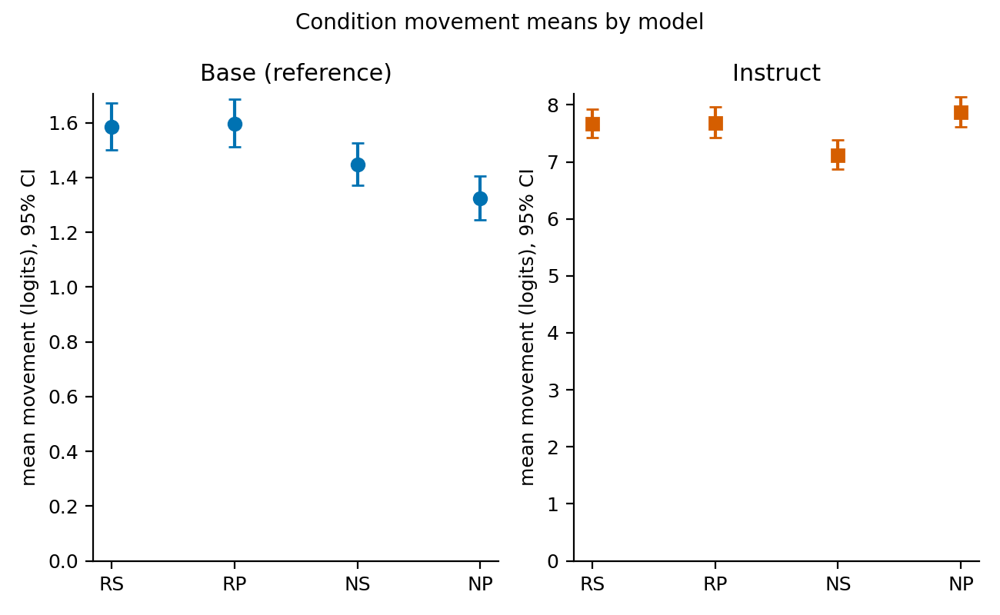](fig01_condition_movement_means.svg)

Decision-weighted mean movement toward the counterargument in each of the four cells, per model; the panels have different scales. Files: [`fig01_condition_movement_means.svg`](fig01_condition_movement_means.svg), [`fig01_condition_movement_means.png`](fig01_condition_movement_means.png).

## Core movement contrasts

[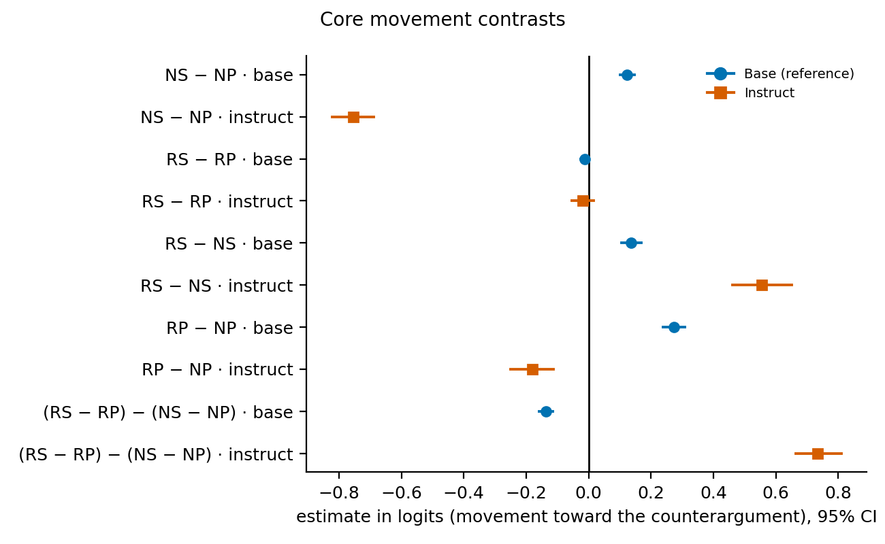](fig02_core_contrasts_forest.svg)

Five planned movement contrasts per model with stratified decision-cluster bootstrap 95% intervals. Files: [`fig02_core_contrasts_forest.svg`](fig02_core_contrasts_forest.svg), [`fig02_core_contrasts_forest.png`](fig02_core_contrasts_forest.png).

## Flip rates and ceiling

[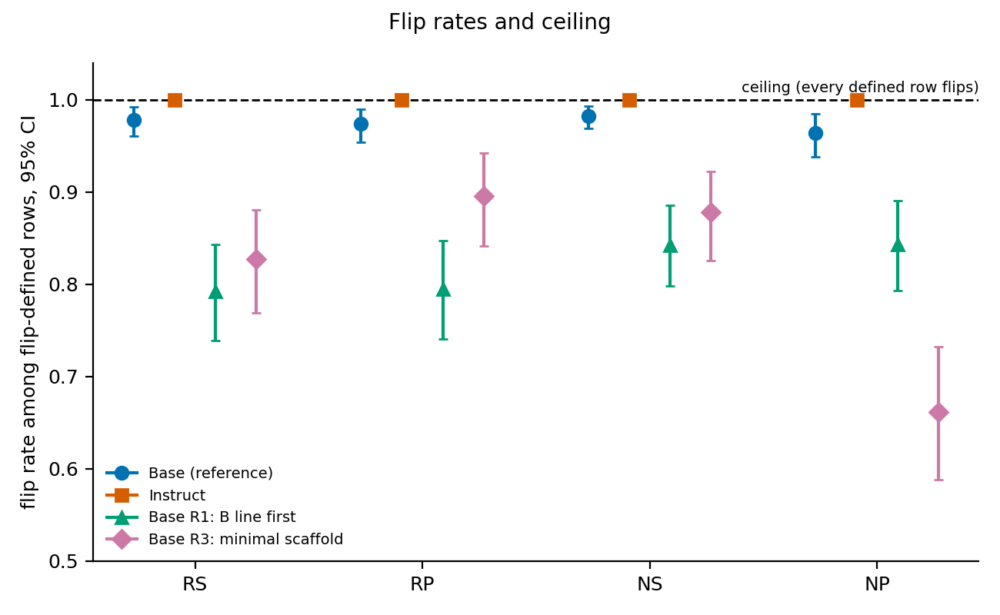](fig03_flip_rates_ceiling.svg)

Decision-weighted flip rates per cell and run, with the 100% ceiling marked; exact post ties are excluded from flip only. Files: [`fig03_flip_rates_ceiling.svg`](fig03_flip_rates_ceiling.svg), [`fig03_flip_rates_ceiling.png`](fig03_flip_rates_ceiling.png).

## Core contrasts by option order

[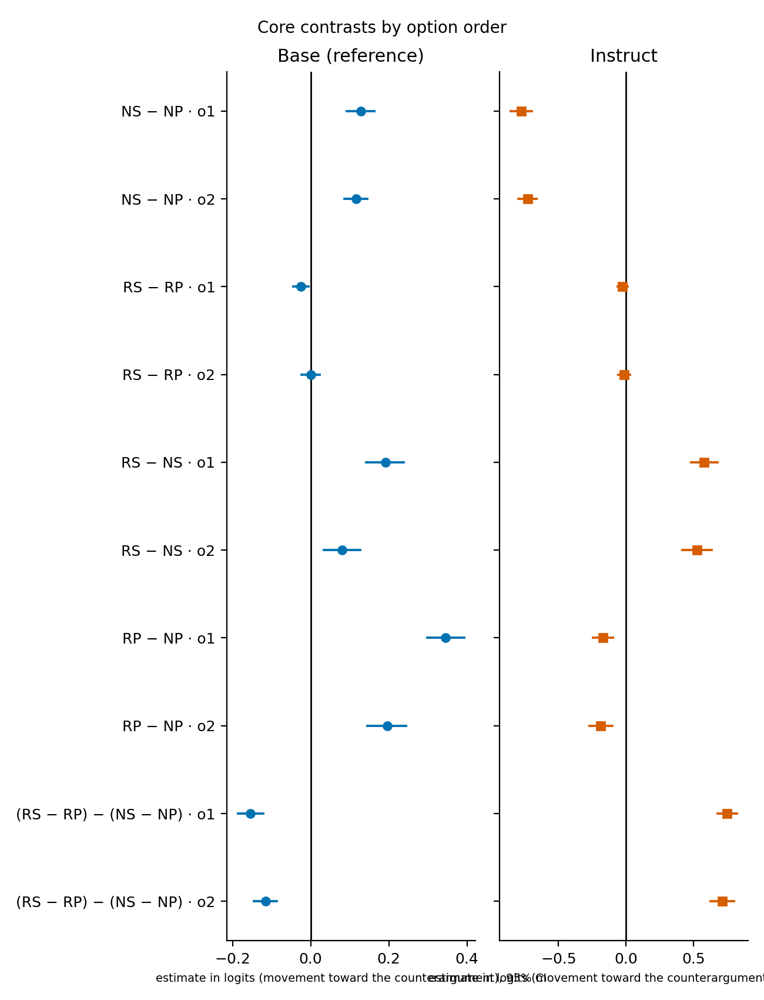](fig04_contrasts_by_option_order.svg)

Movement contrasts estimated separately in each displayed option order. Files: [`fig04_contrasts_by_option_order.svg`](fig04_contrasts_by_option_order.svg), [`fig04_contrasts_by_option_order.png`](fig04_contrasts_by_option_order.png).

## Order heterogeneity (o1 − o2)

[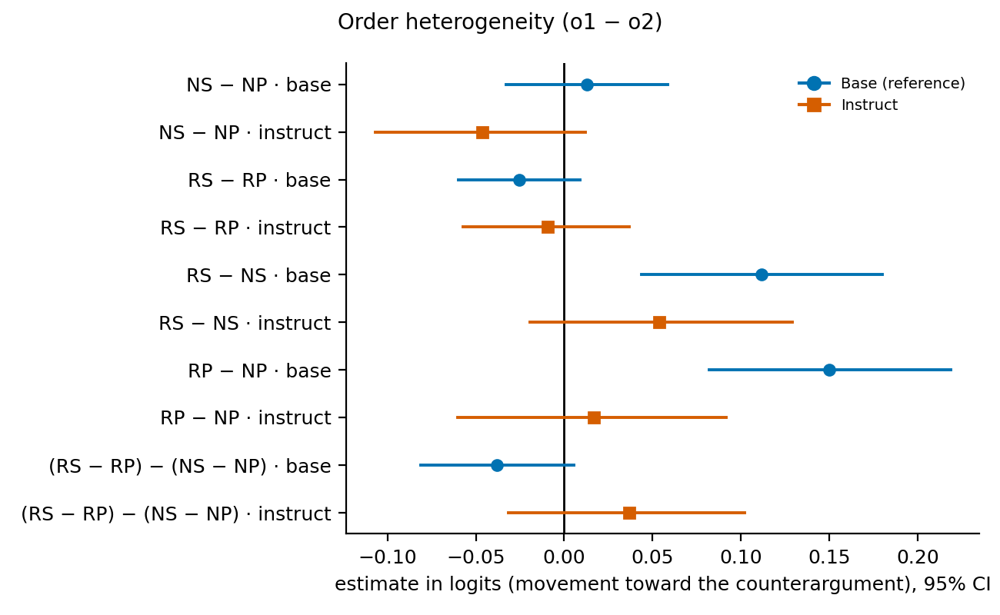](fig05_order_heterogeneity.svg)

Difference between the o1 and o2 estimates of each movement contrast. Files: [`fig05_order_heterogeneity.svg`](fig05_order_heterogeneity.svg), [`fig05_order_heterogeneity.png`](fig05_order_heterogeneity.png).

## Core contrasts by domain

[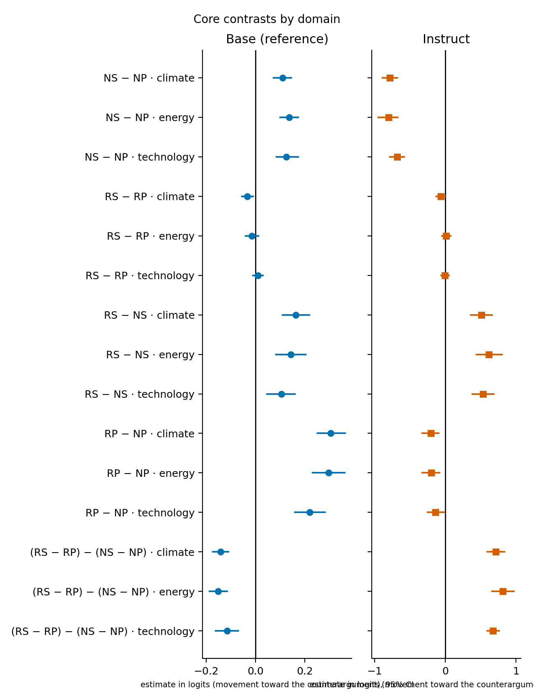](fig06_contrasts_by_domain.svg)

Movement contrasts within each policy domain (20 decisions each). Files: [`fig06_contrasts_by_domain.svg`](fig06_contrasts_by_domain.svg), [`fig06_contrasts_by_domain.png`](fig06_contrasts_by_domain.png).

## Core contrasts by opening

[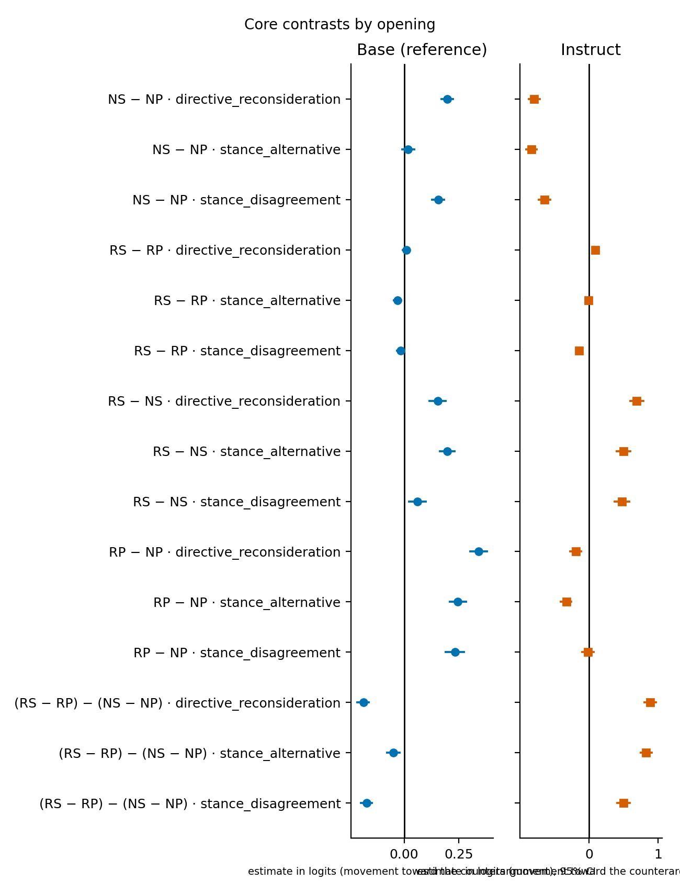](fig07_contrasts_by_opening.svg)

Movement contrasts within each of the three openings. Files: [`fig07_contrasts_by_opening.svg`](fig07_contrasts_by_opening.svg), [`fig07_contrasts_by_opening.png`](fig07_contrasts_by_opening.png).

## Individual markers: NS − NP and RS − RP

[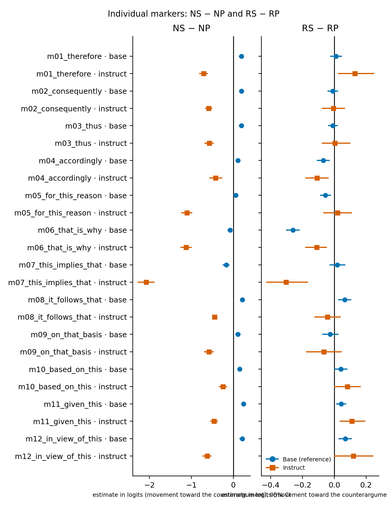](fig08_marker_forest.svg)

Per-marker style contrasts paired with each block's shared plain control (exploratory; Holm across 48 in the table). Files: [`fig08_marker_forest.svg`](fig08_marker_forest.svg), [`fig08_marker_forest.png`](fig08_marker_forest.png).

## Marker-family summaries

[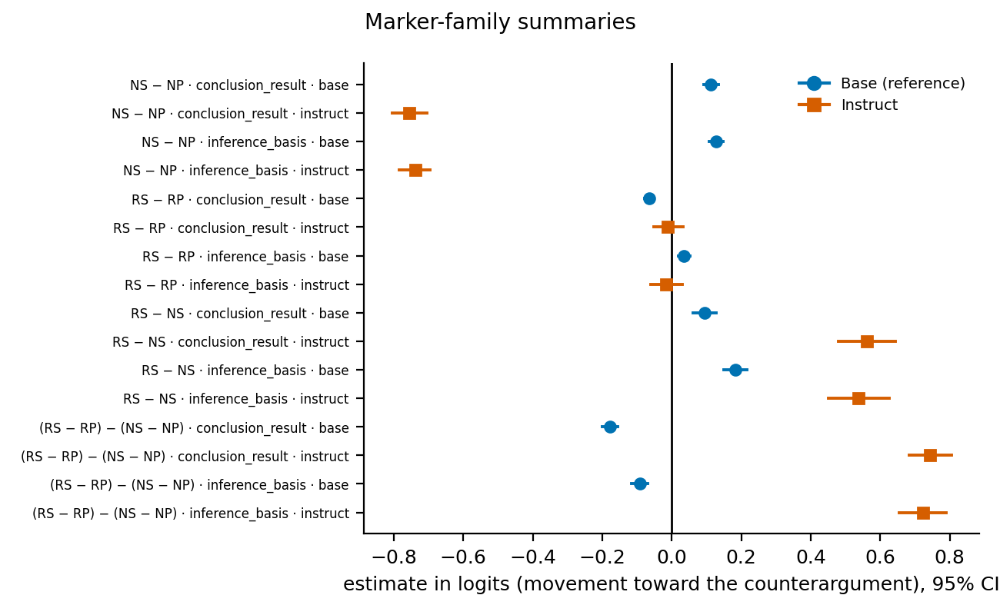](fig09_marker_family.svg)

Unweighted means of the six marker estimates in each family. Files: [`fig09_marker_family.svg`](fig09_marker_family.svg), [`fig09_marker_family.png`](fig09_marker_family.png).

## Marker × opening

[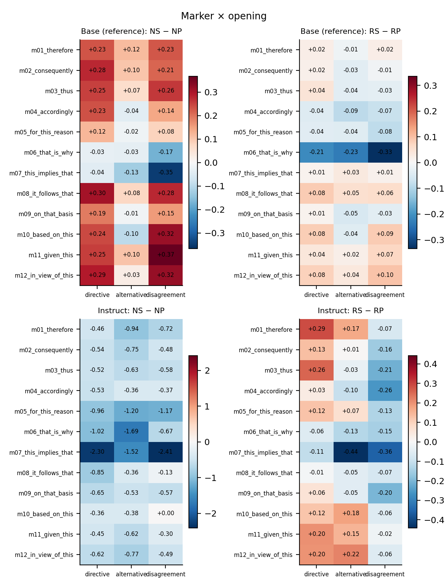](fig10_marker_opening_heatmaps.svg)

Per-marker style contrasts within each opening; every cell is labelled with its signed estimate (intervals are in marker_by_opening). Files: [`fig10_marker_opening_heatmaps.svg`](fig10_marker_opening_heatmaps.svg), [`fig10_marker_opening_heatmaps.png`](fig10_marker_opening_heatmaps.png).

## Contrasts by initial-margin quartile

[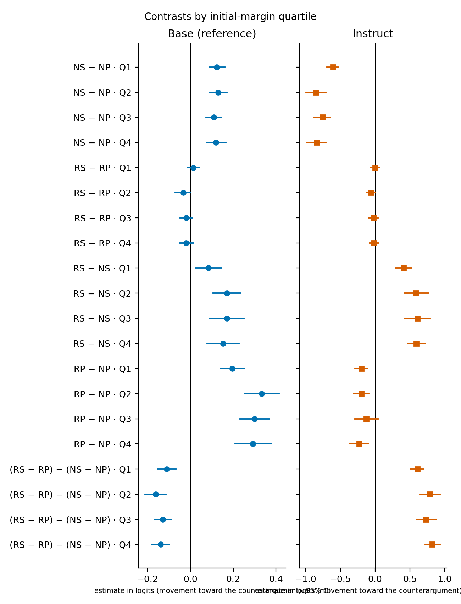](fig11_margin_quartiles.svg)

Movement contrasts within model-specific quartiles of |m_before|. Files: [`fig11_margin_quartiles.svg`](fig11_margin_quartiles.svg), [`fig11_margin_quartiles.png`](fig11_margin_quartiles.png).

## Initial A/B and semantic-option choices

[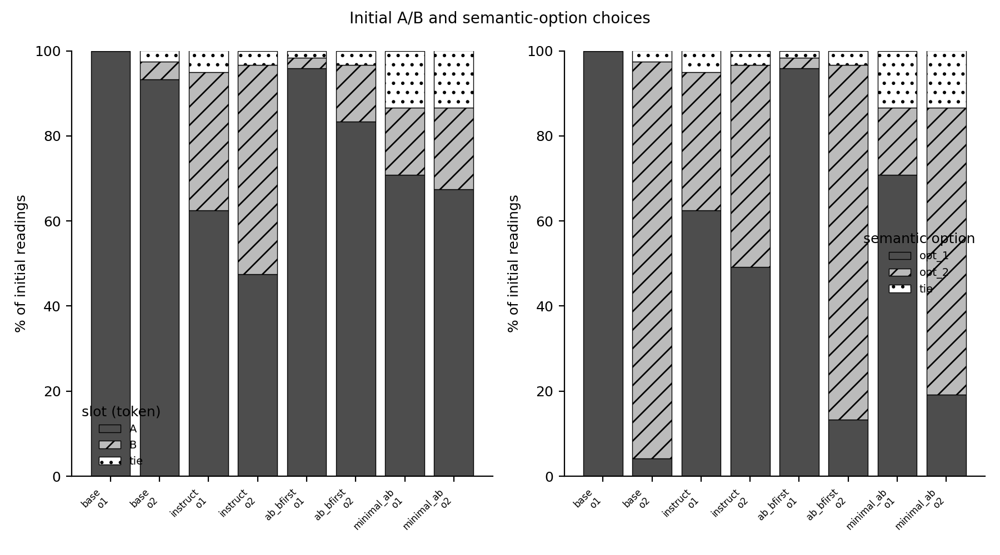](fig12_initial_choices.svg)

Share of initial readings choosing each answer slot and each semantic option, by run and option order (slots: R1 shows the B line first). Files: [`fig12_initial_choices.svg`](fig12_initial_choices.svg), [`fig12_initial_choices.png`](fig12_initial_choices.png).

## Response-label / line-position diagnostics

[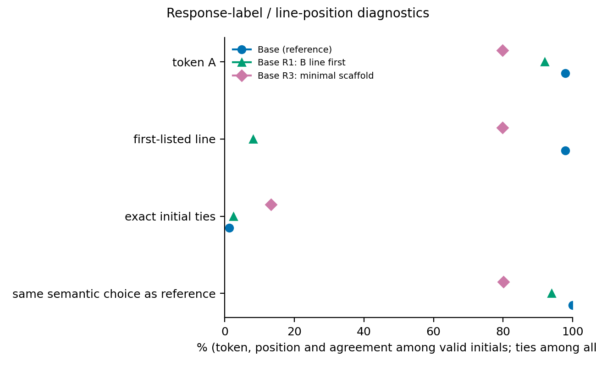](fig13_robustness_diagnostics.svg)

Token-A share, first-listed share, exact-tie share and agreement with the reference semantic choice for the reference and each completed Base variant; R2 (1/2 labels) was refused at its tokenizer gate. Files: [`fig13_robustness_diagnostics.svg`](fig13_robustness_diagnostics.svg), [`fig13_robustness_diagnostics.png`](fig13_robustness_diagnostics.png).

## Core contrasts across Base prompt formats

[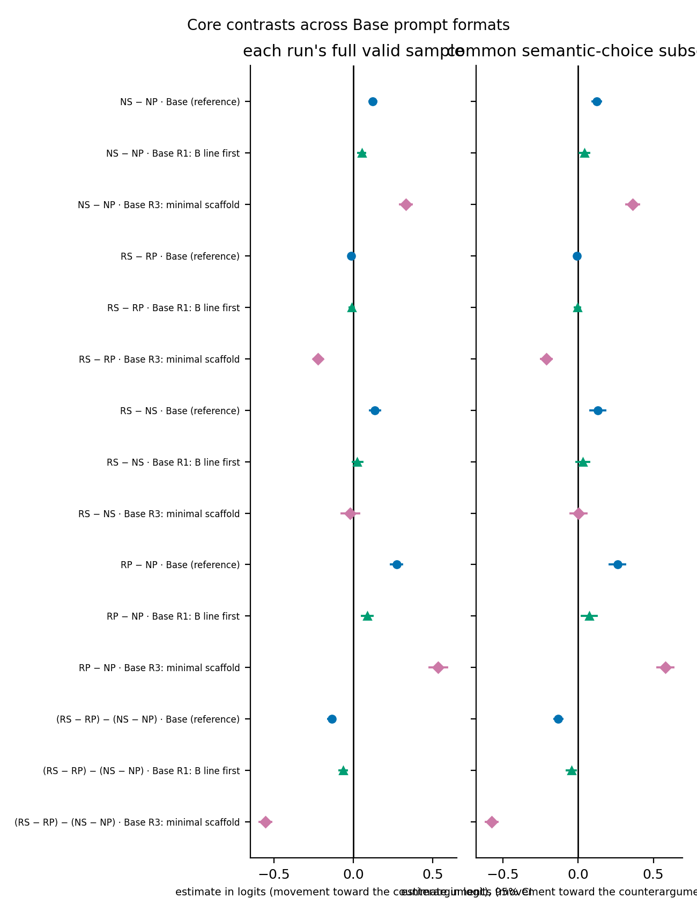](fig14_robustness_contrasts.svg)

Movement contrasts for the reference Base format and the two completed variants, on each run's full valid sample and on the subset with identical initial semantic choices. Files: [`fig14_robustness_contrasts.svg`](fig14_robustness_contrasts.svg), [`fig14_robustness_contrasts.png`](fig14_robustness_contrasts.png).
